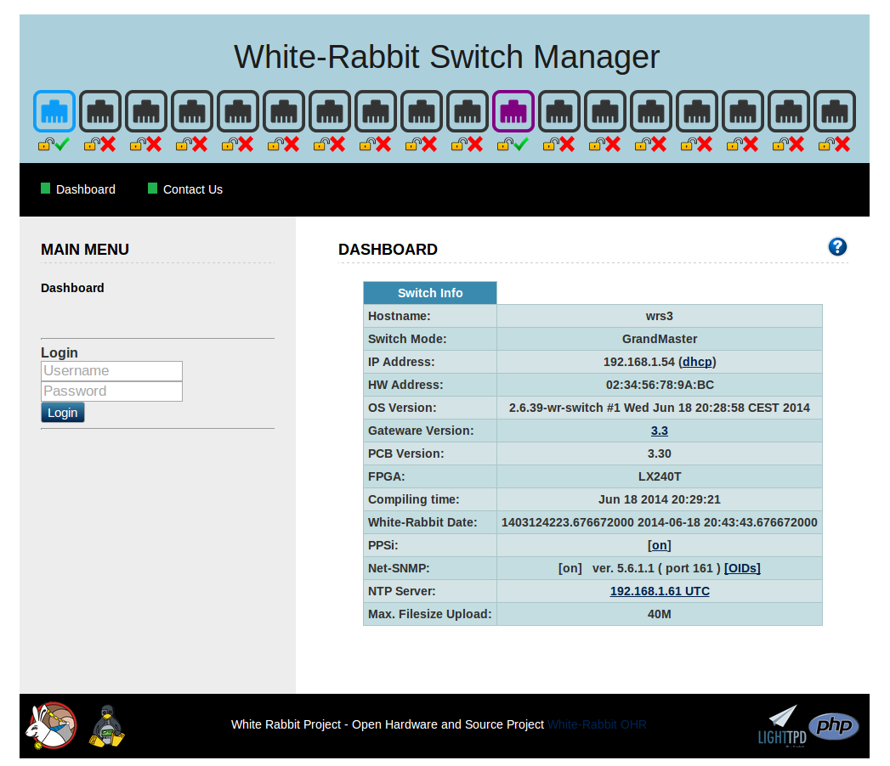

% WRS-3/18 - User Guide
% Benoit Rat, Rodrigo Agis (Seven Solutions)

### Copyright

This document is copyrighted (under the Berne Convention) by Seven
Solutions company and is formally licensed to the public under **GPL v2.0** license.
Report content can be copied, modified, and redistributed.

The Seven Solutions Logo can not be modified in any form, or by any means without prior
written permission by Seven Solutions.

### Licenses

~~~~~~~
The "User Guide" (as defined above) is provided under the terms of GPL v2.0
Copyright (C) 2013 - Seven Solutions

This program is free software; you can redistribute it and/or
modify it under the terms of the GNU General Public License
as published by the Free Software Foundation; either version 2
of the License, or (at your option) any later version.

This program is distributed in the hope that it will be useful,
but WITHOUT ANY WARRANTY; without even the implied warranty of
MERCHANTABILITY or FITNESS FOR A PARTICULAR PURPOSE.  See the
GNU General Public License for more details.

You should have received a copy of the GNU General Public License
along with this program; if not, write to the Free Software
Foundation, Inc., 51 Franklin Street, Fifth Floor, Boston, MA  02110-1301, USA.
~~~~~~~~~

The [WRS] has been released under the **CERN OHL** licence.

~~~~~~~
Copyright CERN 2011.
This documentation describes Open Hardware and is licensed under the CERN OHL v. 1.1.

You may redistribute and modify this documentation under the terms of the
CERN OHL v.1.1. (http://ohwr.org/cernohl). This documentation is distributed
WITHOUT ANY EXPRESS OR IMPLIED WARRANTY, INCLUDING OF
MERCHANTABILITY, SATISFACTORY QUALITY AND FITNESS FOR A
PARTICULAR PURPOSE. Please see the CERN OHL v.1.1 for applicable
conditions
~~~~~~~~~~~~~~~~~

\clearpage

### Revision table

------------------------------------------------------------------------
 Rev      Date          Author          Comments
-----  ----------- -------------------  --------------------------------
 0.1   18/02/2013   Benoit Rat\         Initial Version\
                    [Seven Solutions]   Reviewer: Rodrigo Agis ([7S])

 0.2   26/03/2013   Benoit Rat\         Adding suggestion from\
                    [Seven Solutions]   Beck, Dietrich Dr (GSI)

 0.3   27/03/2013   Benoit Rat\         Modifying licence to GPL v2.0\
                    [Seven Solutions]   to be comptabile with the package

 0.4   23/05/2013   Benoit Rat\         Updating 125MHz out to CLK
                    [Seven Solutions]

 0.5   26/07/2013   Benoit Rat\         Adding suggestion from\
                    [Seven Solutions]   Erik Van Der Bij (CERN)

 1.0   26/07/2013   Benoit Rat\         Updating for v3.3 release
                    [Seven Solutions]
------------------------------------------------------------------------

\clearpage

### Glossary

DHCP
:   The Dynamic Host Configuration Protocol to obtain network configuration.
FMC
:	FPGA Mezzanine Card, an ANSI standard for mezzanine card form factor.
HDL
:	Hardware description language.
LM32
:	LatticeMico32 is a 32-bit microprocessor soft core optimized for field-programmable gate arrays (FPGAs).
NAND
:	NAND Flash Memory, a type of reprogrammable non-volatile computer memory.
PCIe
:	Peripheral Component Interconnect Express, a high-speed serial computer expansion bus standard.
PTP
:	Precise Time Protocol, a time synchronization protocol.
SMC
:	SubMiniature version C, coaxial connector used in radio-frequency circuits.
SFP
:	Small form-factor pluggable transceiver, a hot-pluggable transceiver for optical fiber.
SPEC
:	Simple PCIe FMC carrier.
SVEC
:	Simple VME FMC carrier.
UART
:	Universal Asynchronous Receiver/Transmitter.
WR
: 	White Rabbit.
WRS
: 	White Rabbit Switch.
WMI
:   Web Management Interface

\clearpage

Introduction
=================

The White Rabbit Switch ([WRS]) is the key component of the
White Rabbit Protocol that provides precision timing and high synchronization over an Ethernet-based network.

About this Guide
-----------------

This document is intended as a user guide for quickly setup your switch in
a White Rabbit Network. For more details on advanced topics please
refers to the [Advanced configuration section](#advanced-configuration) or
to the [wr-switch-sw.pdf] guide.

Product Overview
==================

Package
------------

The [WRS] package is composed of various elements:

* The packaging box
* A power cable according to the country of distribution.
* The 18 SFP ports switch.
* SFP LC connectors
    * 16x AXGE-3454-0531 (violet)
    * 2x AXGE-1254-0531 (blue)

> ***Note:*** The SFP LC connectors are optional. Consult the [SFPs Wiki] for more information about the compatibility of SFPs and how to use them.

Front panel (Legend)
---------------------

1. The 18 SFP ports
#. Synced/Activity LEDs
#. Link/WR Mode LEDs
#. Management Mini-USB (B) port
#. Status LED
#. Power LED
#. PPS output
#. Synced CLK reference Output (62.5 MHz)
#. PPS input (GPS Clock)
#. 10MHz reference clock input (GPS/Cesium)
#. 125MHz reference clock input (Not used)
#. Ethernet 100Mbps Management Port

Back panel (Legend)
--------------------

13. Ground Connector
#. Generic Button
#. Flashing Button ([See firmware update](#firmware-update))
#. RS232 Management Port (GPRMC)
#. FPGA Mini-USB (B) UART
#. ARM Mini-USB (B) UART
#. Power Switch
#. Power Plug
#. Serial Number and MACs

Basics
==================

Default Setting
----------------

The device is factory configured with the following default settings:

* IP configuration is **DHCP**
* MACs are given by the manufacturer; labeled on back panel [#21](#back-panel-legend)
	* MAC1 corresponds to the managment port (RJ45).
	* MAC2 corresponds to the first SFP port ($wr[0-17] \Leftrightarrow \textrm{MAC2}+[0-17]$).
* WR mode is **BoundaryClock** (Simple Master)
	* The first two ports (SFPs 1 & 2) are configured as WR slave.
	* The other ports (SFPs [3-18]) are configured as WR master.
* SSH user: **root**
* SSH password: (empty/just press enter)
* Boot method: from Nandflash firmware
* Web Management Interface user: **admin**
* Web Management Interface password: (empty)

Quick Startup
--------------

To get the switch quickly working we recommend you to:

1. Plug an Ethernet cable to the *Ethernet 100Mpbs Management Port*.
#. Plug the power cable to the *Power Plug*.

After all connections have been made, toggle the power-switch on to turn
the device on. After the power on, the [WRS] should behave as follows:

3. The *Power LED* goes green
#. After 15s, the *Status LED* goes orange which means that the [WRS]'s kernel
has started.
#. Then the fan start working which means that FPGA has been correctly programmed.
#. Finally, it goes green when everything is succesful (PLL is locked).

You have now the [WRS] ready to be used in a WR network.

7. Connect the blue SFPs (AXGE-1254-0531) to the SFP port 1 and 2 of the
[WRS]. These SFPs are the ones that will receive synchronization message
from another master [WRS] or from the grandmaster [WRS]. If you only have
one switch in your network you might configure it in the
[GrandMaster mode](#grandmaster-mode).
#. You can plug the other SFP ports [2-16] with violet SFPs (AXGE-3454-0531)
to the WR node such as [SPEC], [SVEC], ...

USB Connections
----------------

The [WRS] has three different USB ports used to communicate/monitorize
through a PC.

a. Management Mini-USB (B) port
b. FPGA Mini-USB (B) UART
c. ARM Mini-USB (B) UART

These ports correspond themselve to different devices on your computer.

a. ttyACM0 (when the *Status LED* is green)
b. ttyUSB0
c. ttyUSB1

To connect to them you need to open a serial console such as minicom[^minicom]

~~~~~{.bash}
## Connecting to the Management USB port
minicom -D /dev/ttyACM0 -b 115200

## Connecting to the FPGA UART
minicom -D /dev/ttyUSB0 -b 115200

## Connecting to the ARM UART
minicom -D /dev/ttyUSB1 -b 115200

~~~~~~~~~~~~

[^minicom]: In Debian-like distribution you can install minicom by executing
`sudo apt-get install minicom`.

> Note: ttyUSB0 and ttyUSB1 usally correspond respectively to FGPA and ARM UART.
However this order can change dependably on how you plug the cable.

Login via USB
--------------

Once the device has been correctly started up (*Status LED* is green),
It is recommended to use the USB management port to connect to the device
instead of the ARM UART.

~~~~~{.bash}
## Connecting to the Management USB port
minicom -D /dev/ttyACM0 -b 115200
~~~~~~~~~~

The ARM UART is usually employed during development and monitoring because
the kernel and daemons messages are sent to this console.

Login via SSH
--------------

The Ethernet management port automatically obtains its IP using the DHCP
protocol. If you don't have any DHCP router/server in your network please
refer to the [non-DHCP](#non-dhcp-user) section.

To obtain the IP of the [WRS] you can connect to your DHCP server interface
and retrieve the IP, or [connect to ttyACM0](#login-via-usb) to retrieve the
IP (`ipconfig eth0`).

If the [WRS] IP is for example `192.168.1.50` you might connect using:

	ssh root@192.168.1.50

And press enter when requesting the password.

Login using Windows
-----------------------

The process of login to the switch using Windows (XP,Vista,7,8) is pretty
similar:

1. You first need to download the [Putty Tool] and install it.

2. Then you need to list and find out which serial port in Windows corresponds
to which interface. A simple way to perform this is to plug only one USB
cable at a time, and go to `Device Manager > Ports (COM & LPT)`
to check the name of the `COM<X>` port.

3. Finally to connect through the USB you just need to open the Putty
tool and configure it as indicated in the figure below. Do not forget to replace the
`COM9` port name by the one that corresponds to the USB management.

4. Similarly, you can connect to the [WRS] using the SSH protocol.
You should not forget to replace the IP of your [WRS] (yellow)
by the one in your subnetwork.

Login using the Web Management Interface
-----------------------

If you want to access and manage the [WRS] using the web interface, it is necessary to connect the [WRS] manager ethernet port to your local network.
The access should be carried out by a network browser (Mozilla Firefox and Google Chrome supported) as it follows:

1. Open your browser and type the IP address (i.e. 192.168.1.50) of the [WRS]. By default, the network IP configuration
is provided by the DHCP server in the same network and can be retrieved from it.

2. After accessing the [WMI], you should enter the web interface user and password, which is not
same for the SSH connection, otherwise you will be only able to see the Dashboard info.
By default the user is **admin** with no password. For this reason it is strongly recommended to change the password.

In order to change the [WMI] password you just need to click on "**User: admin**" on the left side of the webpage.
You have to enter your username (**admin**), old password, new password and repeat the new password.
Once you submit the new password you will be redirected to the main screen and logged out.

After login:
-------------------

Once you are logged in you can use various tools to monitor the [WRS].
All these tools are found in `/wr/bin/` which is included in the `$PATH`.

The following list resumes the most interesting commands:

 * `wrs_version`:	Print information about the SW & HW version of the [WRS].
 * `rtu_stat`:	Routing Table Unit Statistic, returns the routing table information where we can find which MAC needs to be forwarded to which port. It also allows to add and delete entries.
 * `wr_mon`:	WR Switch Sync Monitor, outputs information about the state of WR syncrhonisation such as Phase Tracking, Master-Slave delay, link asymmetry, etc...
 * `spll_dbg_proxy`: 	SoftPLL debug proxy, reads out the debug FIFO datastream from the SoftPLL and proxies it  via TCP connection to the application running on an outside host, where it can be plotted, analyzed, etc.

> Note: More information about each tool can be obtain using the embedded help argument: `--help`, `-h` or `help`.

#### Warning:
The SFP ports are labeled from 1 to 18 on the front panel but their corresponding
network interface are named from `wr0` to `wr17`.

Web Management Interface Features:
-------------------

[WMI] is a web interface that allows the [WRS] management from a web browser. It displays the main configuration and status of the main services and programms that are available for the switch, such as endpoints' mode and calibration status, SFP calibration, PTP, SNMP, VLANs, etc. It acts as an abstraction layer between the back-end scritps and programs in */wr/bin/* folder, making the WR switch management easier for the user.

List of all the actions that can be performed by using the [WMI]:

- Display info: IP configuration, switch HW/SW/GW description, WR date, PPSi status, SNMP server status, NTP server status.
- Stop/run services: PPSi, WRSW_HAL, NTP.
- NTP server setup.
- Modify endpoint wr_master/wr_slave mode.
- VLAN setup.
- White-Rabbit timing.
- Modify maximum filesize of uploaded files to the switch.
- PPSi daemon configuration: clock class, clock accuracy, etc.
- Terminal simulation avoiding SSH connections.
- Login system.
- Modify login password.
- Load lm32 and FPGA binaries into the switch.
- Switch reboot.
- Backup and restore configuration files for services (PPSi, HAL, SNMP, etc).
- Restore configuration files from tarball.
- Flash firmware.
- Backup firmware.

Configurations
==================

Booting
------------

After 10 seconds, the bootloader automatically loads the [WRS] firmware
from the Flash NAND memory of the switch.  If you connect to the ARM debug
port you might see the following message:

~~~~~{.bash}
Welcome on WRSv3 Boot Sequence
      1: boot from nand (default)
      2: boot from TFTP script
      3: edit config
      4: exit to shell
      5: reboot
~~~~~~~~~~~~~~~~~~~

> Note: If you want to change how
the [WRS] is booted you can place a `wrboot` script in your TFTP root
folder and select the second option or you can edit the configuration
(third option). Please find more explanations in the
[Advanced configuration](#advanced-configuration)

Non-DHCP user
---------------

If you have no DHCP server in your network you must connect to the [WRS]
using the [login via USB method](#login-via-usb) and then edit the
`interfaces` file:

~~~~{.bash}
vi /etc/network/interfaces
~~~~~~~~~~~

for example, in a `192.168.1.x` subnetwork you might replace the
`iface eth0 inet dhcp` by

~~~~~{.bash}
iface eth0 inet static
     address 192.168.1.10
     netmask 255.255.255.0
     network 192.168.1.0
     broadcast 192.168.1.255
     gateway 192.168.1.1
~~~~~~~~~~~~~~

> Note: If you are willing to use TFTP script in a non-DHCP network, you
must also statically set the IP in the bootloader configuration.

GrandMaster mode
-----------------

In a White Rabbit network, almost all the switches are configured as master (a.k.a SimpleMaster)
(default configuration). They transmit the clock signal that cames from other switches.
However the "top" switch connected to the GPS signal is called the **GrandMaster**
and is configured in a specific way.

To configure a switch as GrandMaster you must edit[^viedit] the `wrsw_hal.conf` file

~~~~{.C}
vi /wr/etc/wrsw_hal.conf
~~~~~~~~

And uncommenting the timing.mode value the line below:

~~~~{.Haskell}
timing =  {
	-- other values
	mode = "GrandMaster"; -- grand-master with external reference
};
~~~~~~

For a more detailed explanation on how to configure and connect the switch as GrandMaster, please consult the
[wr_external_reference.pdf] document.

[^viedit]: To edit in `vi`: `Ins` Insert text; `Esc` back to normal mode; `:wq` Save and Exit

Firmware updates
------------------

This section proposes a simple way to update the firmware of the [WRS]
by flashing the memory using the *Management Mini-USB*[^flashlinux].

1. Download the [flashing package] and extract it.
#. Download the [latest stable release] of the [WRS] firmware in a tar.gz package.
#. Connect the *Management Mini-USB* port to the PC[^checkusb].
#. Start the flashing procedure by executing in a linux console:
`flash-wrs -e -m1 <MAC1> -m2 <MAC2> wr-switch-sw-<latest_version>.tar.gz`
where MAC1 and MAC2 are written in the [back panel (label #21)](#back-panel-legend)

5. At this step you will be asked to restart the [WRS], using the *Power
Switch*, while pressing the *Flash Button*.
#. The flashing procedure should start and it takes some time to perform.
#. The switch will restart by itself which means that the flashing operation
has finished.

[^flashlinux]: The flashing operation is only available for linux environment, and
it is recommended to use Debian-like distribution such as "Ubuntu"

[^checkusb]: Please, make sure that the managment USB port (ttyACM0)
is not used by another process such as minicom.

Advanced configuration
-----------------------

Please refer to the White Rabbit Switch: software build scripts manual
([wr-switch-sw.pdf]) that explains advanced topics such as:

* Advanced flashing options.
* Configuring specific MAC address.
* Modification of the bootloader.
* Changing Slave/Master port type.
* Building from the sources.
* etc.

Safety Notes
=============

#### Warning:
Do not block the air vents which are located on back panel of the [WRS],
the internal temperature might increase and damage the switch.

#### Warning:
To increase the lifetime of the [WRS] it is recommended to use the switch
in a controlled ambient environment and limit to the ambient condition
stated in the [Specification Appendix](#specification).

#### Warning:
The standard power source for this equipment is designed to work in the
range of 110-240V with 50-60Hz.

#### Warning:
This equipment is intended to be grounded using the *Grounded Connector*.
Ensure that the host is connected to earth ground during normal use.

Appendix
============

Specification
----------------

+--------------------+-------------------------------------------------+
| ***FPGA***         |                                                 |
+====================+=================================================+
| **Type**           | Xilinx Virtex-6 (LX240T)                        |
+--------------------+-------------------------------------------------+
| **Package**        | 1156-pin BGA                                    |
+--------------------+-------------------------------------------------+
| **Slices**         | 37,680 (4 LUTs and 8 flip-flops)                |
+--------------------+-------------------------------------------------+
| **Memories**       | 416x36Kb (9,504Kb) Block RAM\                   |
|                    | 32MB NOR Flash                                  |
+--------------------+-------------------------------------------------+
| **Softcore**       | LatticeMico32 (LM32)                            |
+--------------------+-------------------------------------------------+
| **I/O**            | 20 GTX transceivers for SFP links\              |
|                    | 40 GPIO for generic purpose                     |
|                    | (LEDs, SFP detection, ...)                      |
+--------------------+-------------------------------------------------+
| **Monitoring**     | Monitoring power supply                         |
+--------------------+-------------------------------------------------+
| **Temperature**    | Sensor control                                  |
+--------------------+-------------------------------------------------+

+--------------------+-------------------------------------------------+
| ***CPU***          |                                                 |
+====================+=================================================+
| **Type**           | ARM Atmel AT91 SAM9G45                          |
+--------------------+-------------------------------------------------+
| **Core**           | 400MHz (ARM926E)                                |
+--------------------+-------------------------------------------------+
| **Memories**       | 64MB DDR2 (16-bit bus chip)\                    |
|                    | 256MB NAND flash chip\                          |
|                    | 8MB boot flash                                  |
+--------------------+-------------------------------------------------+
| **I/O**            | 32bit Async Bridge with FPGA\                   |
|                    | 100Base-T Ethernet                              |
+--------------------+-------------------------------------------------+
| **OS**             | Linux (Kernel v2.6.39)                          |
+--------------------+-------------------------------------------------+

+--------------------+-------------------------------------------------+
| ***OnChip Clock*** |                                                 |
+====================+=================================================+
| **PLL**            | AD9516 (14-Output Clock Generator               |
|                    | with Integrated 1.6 GHz VCO)                    |
+--------------------+-------------------------------------------------+
| **Synthesizer**    | TI CDCM61002RHBT (28-683MHz)                    |
+--------------------+-------------------------------------------------+
| **DAC**            | 2xAD5662BRJ (16bit; 2.7-5.54V)                  |
+--------------------+-------------------------------------------------+

+--------------------+-------------------------------------------------+
| ***Others***       |                                                 |
+====================+=================================================+
| **Soldering**      | IPC- 610 Rev E Class 2                          |
+--------------------+-------------------------------------------------+
| **Certification**  | ISO-9001, ISO-14001, CE, RoHS                   |
+--------------------+-------------------------------------------------+
| **Power Supply**   | 100-240VAC, 2.0A 50-60 Hz\                      |
|                    | 12V DC, 6.66A – 80W max                         |
+--------------------+-------------------------------------------------+
| **Environmental**  | Temperature: -10ºC ~ +50ºC\                     |
| **Conditions**     | Humidity:    0% ~ 90% RH                        |
+--------------------+-------------------------------------------------+

Features
----------

* PTPv2 (IEEE 1588-2008)
* WRP daemon (node discovery, etc.)
* DHCP client
* SSH server
* Web Management Interface
* Python Support
* NTP Client/Relay/Server
* ARP/ DNS / EtherWake protocol

Warranty
-------------

The [WRS] is fully factory tested and warranted against manufacturing defects for a period of one year.  As the
circumstances under which this [WRS] is installed can not be controlled, failure of the [WRS] due to
installation problems can not be warranted. This includes misuse, miswiring, overheating, operation under loads beyond the
design range of the [WRS].
For warranty or non-warranty replacement send the [WRS] to:

> Seven Solutions\
C/ Baza, parcela 19, nave 3 \
Polígono Industrial Juncaril, \
18210 Peligros \
(Granada), SPAIN.

FAQs & Troubleshooting
--------------------------

If you are experiencing some issues please look first at the [WRS FAQ] wiki
page if you can find an answer.

You can also reach out the wiki to see if your issue is a known
bug and if a solution was found:
<http://www.ohwr.org/projects/wr-switch-sw/wiki/Bugs>

You can also request Technical Support by
[contacting our company](#contact-us)

### Bug report

Feel free to send us a bug report with the full state of the [WRS] by
executing the following command:

~~~~~{.bash}
#On the WRS
wrs_version > /tmp/bug_report.txt
rtu_stat >> /tmp/bug_report.txt
dmesg >> /tmp/bug_report.txt

#Obtain the IP of the switch
ifconfig eth0 | grep addr
~~~~~~~~~~~~

And retrieving the file from your computer by using SSH:

~~~~~{.bash}
#On your client
scp root@<IP_of_the_switch>:/tmp/bug_report.txt ~
~~~~~~~~~~~~~~

Contact-Us
-----------

To contact Seven Solutions company please use:

* <info@sevensols.com>
* (+34) 958 285 024
* <http://www.sevensols.com>

Save Our Environment
---------------------

\

This symbol means that when the equipment has
reached the end of its life cycle, it must be taken
to a recycling centre and processed separate from
domestic waste.

The cardboard box, the plastic contained in the packaging,
and the parts that make up this device can be recycled in
accordance with regionally established regulations.

Never throw this electronic equipment out along with
your household waste. You may be subject to penalties or
sanctions under the law. Instead, ask for instructions from
your municipal government on how to correctly dispose of it.
Please be responsible and protect our environment.

References
==============

* [wrs-3/18.pdf]: Datasheet for the White Rabbit Switch v3 - 18 SFPs
* [wr-switch-sw.pdf]: Advanced documentation on how using the software
* [wr_external_reference.pdf]: Connect the [WRS] in GrandMaster mode.
* [whiterabbitsolution]: White Rabbit as a complete timing solutions
* [WRS Wiki]: White Rabbit Switch Wiki on ohwr.org
* [WRS FAQ]: WR-Switch Frequently Added Questions
* [wr-switch-testing]: Project for testing the switch itself
* [SFPs Wiki]: Type of SFP supported by the [WRS]
* [latest stable release]: http://www.sevensols.com/dl/wr-switch-sw/bin/latest_stable.tar.gz
* [flashing package]: http://www.sevensols.com/dl/wrs-flashing/latest_stable.tar.gz

<!-- List of links -->

[whiterabbitsolution]: http://www.sevensols.com/whiterabbitsolution/
[WRS]: http://www.sevensols.com/index.php?seccion=1410&subseccion=1435
[WR Wiki]:	http://www.ohwr.org/projects/white-rabbit/wiki
[WRS Wiki]:	http://www.ohwr.org/projects/white-rabbit/wiki/Switch
[wr-switch-sw]: http://www.ohwr.org/projects/wr-switch-sw/
[wr-switch-hdl]: http://www.ohwr.org/projects/wr-switch-sw/
[wr-switch-hw]: http://www.ohwr.org/projects/wr-switch-hw/
[wr-switch-testing]: http://www.ohwr.org/projects/wr-switch-testing
[wr-starting-kit]: http://www.ohwr.org/projects/wr-starting-kit/
[SPEC]: http://www.ohwr.org/projects/spec/
[SVEC]: http://www.ohwr.org/projects/svec/
[SFPs Wiki]: http://www.ohwr.org/projects/white-rabbit/wiki/SFP
[Seven Solutions]: http://www.sevensols.com
[7S]: http://www.sevensols.com
[Putty Tool]: http://www.putty.org/
[WRS FAQ]: http://www.ohwr.org/projects/white-rabbit/wiki/FAQswitch
[wr-switch-sw.pdf]: http://www.sevensols.com/dl/wr-switch-sw/latest_stable.pdf
[wr_external_reference.pdf]: http://www.ohwr.org/attachments/1647/wr_external_reference.pdf
[wrs-3/18.pdf]: http://www.sevensols.com/whiterabbitsolution/files/7SP-WRS-3_18.pdf
[latest stable release]: http://www.sevensols.com/dl/wr-switch-sw/bin/latest_stable.tar.gz
[flashing package]: http://www.sevensols.com/dl/wrs-flashing/latest_stable.tar.gz
