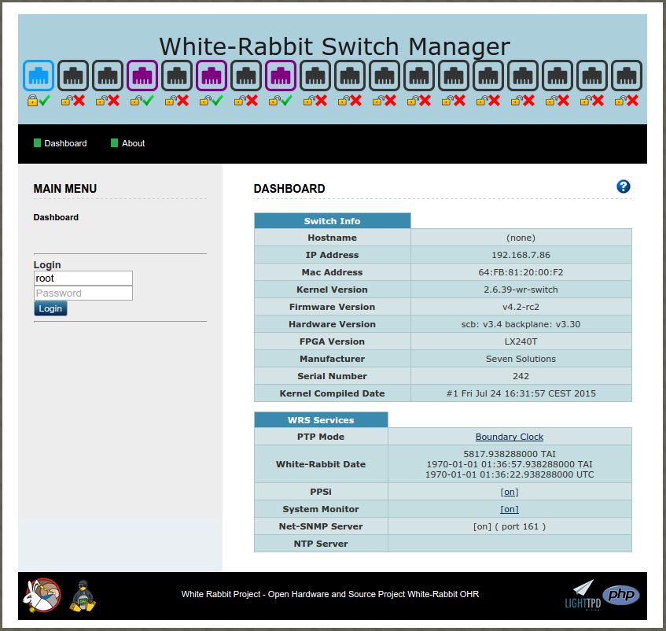
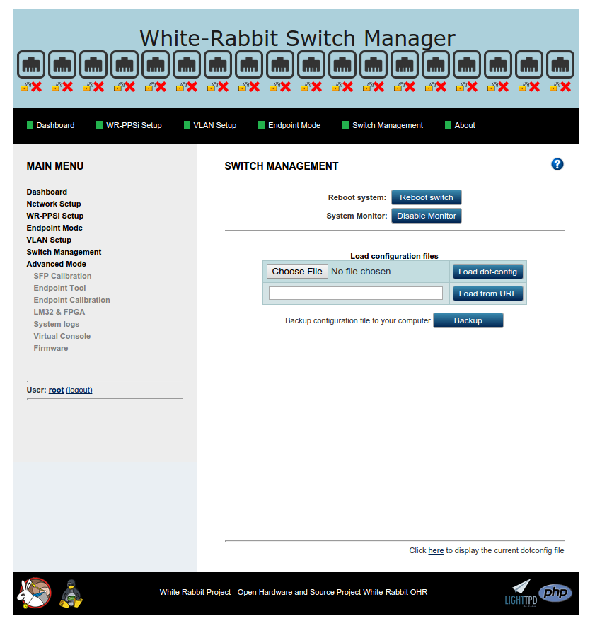
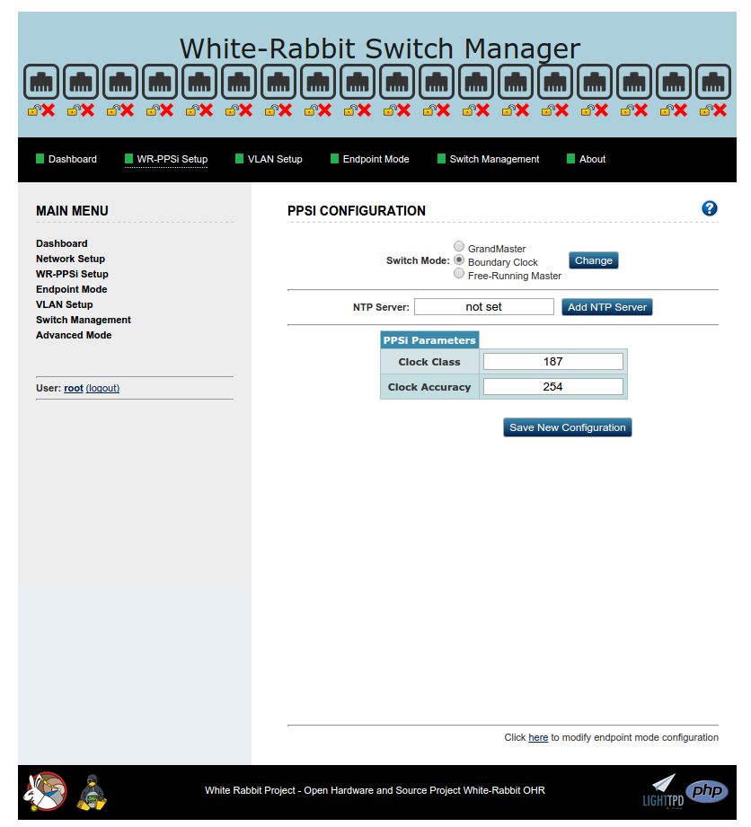
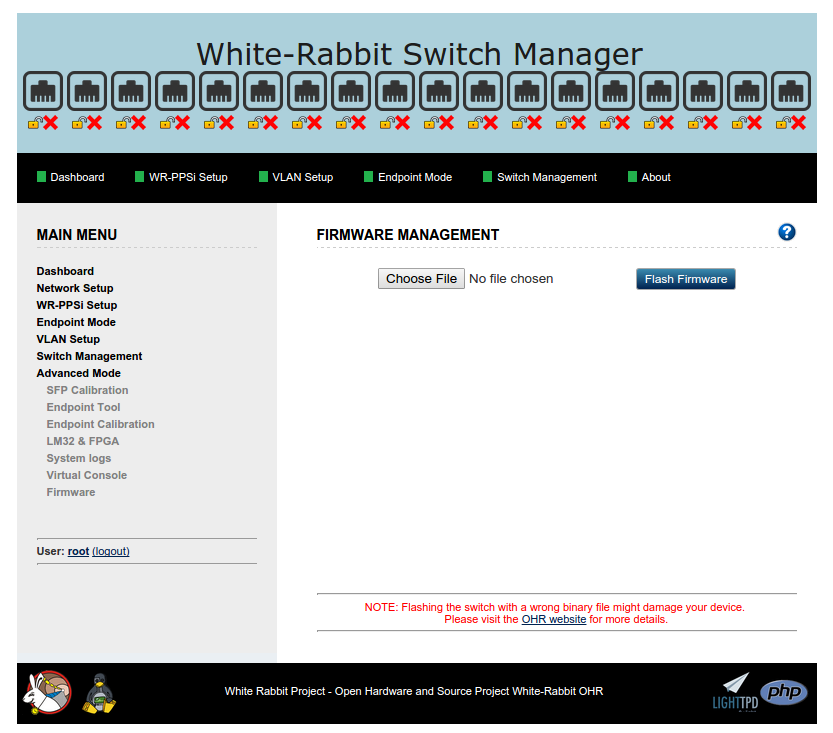

% WRS-3/18 - Startup Guide
% Benoit Rat, Rodrigo Agis (Seven Solutions)

### Copyright

This document is copyrighted (under the Berne Convention) by Seven
Solutions company and is formally licensed to the public under **GPL v2.0** license.
Report content can be copied, modified, and redistributed.

The Seven Solutions Logo can not be modified in any form, or by any means without prior
written permission by Seven Solutions.

### Licenses

~~~~~~~
The "Startup Guide" (as defined below) is provided under the terms of GPL v2.0
Copyright (C) 2014 - Seven Solutions

This program is free software; you can redistribute it and/or
modify it under the terms of the GNU General Public License
as published by the Free Software Foundation; either version 2
of the License, or (at your option) any later version.

This program is distributed in the hope that it will be useful,
but WITHOUT ANY WARRANTY; without even the implied warranty of
MERCHANTABILITY or FITNESS FOR A PARTICULAR PURPOSE.  See the
GNU General Public License for more details.

You should have received a copy of the GNU General Public License
along with this program; if not, write to the Free Software
Foundation, Inc., 51 Franklin Street, Fifth Floor, Boston, MA  02110-1301, USA.
~~~~~~~~~

The [WRS] has been released under the **CERN OHL** licence.

~~~~~~~
Copyright CERN 2011.
This documentation describes Open Hardware and is licensed under the CERN OHL v. 1.2.

You may redistribute and modify this documentation under the terms of the
CERN OHL v.1.2. (http://ohwr.org/cernohl). This documentation is distributed
WITHOUT ANY EXPRESS OR IMPLIED WARRANTY, INCLUDING OF
MERCHANTABILITY, SATISFACTORY QUALITY AND FITNESS FOR A
PARTICULAR PURPOSE. Please see the CERN OHL v.1.2 for applicable
conditions
~~~~~~~~~~~~~~~~~

\clearpage

### Revision table

------------------------------------------------------------------------
 Rev      Date          Author          Comments
-----  ----------- -------------------  --------------------------------
 0.1   18/02/2013   Benoit Rat\         Initial Version\
                    [Seven Solutions]   Reviewer: Rodrigo Agis ([7S])

 0.2   26/03/2013   Benoit Rat\         Adding suggestion from\
                    [Seven Solutions]   Beck, Dietrich Dr (GSI)

 0.3   27/03/2013   Benoit Rat\         Modifying licence to GPL v2.0\
                    [Seven Solutions]   to be comptabile with the package

 0.4   23/05/2013   Benoit Rat\         Updating 125MHz out to CLK
                    [Seven Solutions]

 0.5   26/07/2013   Benoit Rat\         Adding suggestion from\
                    [Seven Solutions]   Erik Van Der Bij (CERN)

 1.0   26/07/2013   Benoit Rat\         Updating for v3.3 release
                    [Seven Solutions]

 1.1   26/07/2014   Jose Luis Gutierrez\ Adding WMI for v4.0 release
                    [Seven Solutions]

 1.2   02/10/2014   Benoit Rat\         Updating for v4.1 release
                    [Seven Solutions]

 1.3   05/08/2014   Benoit Rat\         Updating for v4.2 release
                    [Seven Solutions]

 1.4   15/05/2017   Benoit Rat\         Updating for v5.0.1 release
                    [Seven Solutions]
------------------------------------------------------------------------

\clearpage

### Glossary

DHCP
:   The Dynamic Host Configuration Protocol to obtain network configuration.

FMC
:   FPGA Mezzanine Card, an ANSI standard for mezzanine card form factor.

HDL
:   Hardware description language.

LM32
:   LatticeMico32 is a 32-bit microprocessor soft core optimized for field-programmable gate arrays (FPGAs).

NAND
:   NAND Flash Memory, a type of reprogrammable non-volatile computer memory.

PCIe
:   Peripheral Component Interconnect Express, a high-speed serial computer expansion bus standard.

PTP
:   Precise Time Protocol, a time synchronization protocol.

SMC
:   SubMiniature version C, coaxial connector used in radio-frequency circuits.

SFP
:   Small form-factor pluggable transceiver, a hot-pluggable transceiver for optical fiber.

SPEC
:   Simple PCIe FMC carrier.

SVEC
:   Simple VME FMC carrier.

UART
:   Universal Asynchronous Receiver/Transmitter.

WR
:   White Rabbit.

WRS
:   White Rabbit Switch.

WMI
:   Web Management Interface

\clearpage

Introduction
=================

The White Rabbit Switch ([WRS]) is the key component of the
White Rabbit Protocol that provides precision timing and high synchronization over an Ethernet-based network.

About this Guide
-----------------

This document is intended as a **Startup Guide** for quickly setup your switch in
a White Rabbit Network. For more details on advanced topics please
refers to the [Advanced configuration section](#advanced-configuration) or
to the other manuals.

This document will refer only to [WRS] with hardware v3.3 and v3.4.

The Official Manuals
---------------------

This is the current set of manuals that accompany the [WRS]:

WRS Startup Guide:
:	hardware installation instructions.

This manual is provided by
the manufacturer. It describes handling measures, the external
connectors, hardware features and the initial bring-up of the device.

WRS User's Manual:
:	documentation about configuring the [WRS], at software level.

This guide is maintained by software developers. The manual
describes configuration in a deployed network, either as a
standalone device or as network-booted equipment.  The guide also
describes how to upgrade the switch, because we'll release new
official firmware images over time, as new features are implemented.

WRS Developer's Manual:
:	it describes the build procedure and how internals work.

The manual is by
developers and for developers.  This is the document to check if you
need to customize your [WRS] rebuild software from new repository
commits that are not an official release point, or just install your
[WRS] with custom configuration values.

Product Overview
==================

Package
------------

The [WRS] package is composed of various elements:

* The packaging box
* A power cable according to the country of distribution.
* The 18 SFP ports switch.
* SFP LC connectors
    * 16x AXGE-3454-0531 (violet)
    * 2x AXGE-1254-0531 (blue)

> ***Note:*** The SFP LC connectors are optional. Consult the [SFPs Wiki] for more information about the compatibility of SFPs and how to use them.

Front panel v3.4 (Legend)
---------------------

1. The 18 SFP ports
#. Synced/Activity LEDs
#. Link/WR Mode LEDs
#. Management Mini-USB (B) port
#. Status LED
#. Power LED
#. PPS output
#. CLK1 output (62.5 MHz PLL)
#. CLK2 output (Auxiliary clock, default is 10MHz)
#. 10MHz reference clock input (GPS/Cesium)
#. PPS reference input
#. Ethernet 100Mbps Management Port

Front panel v3.3 (Legend)
---------------------

1. The 18 SFP ports
#. Synced/Activity LEDs
#. Link/WR Mode LEDs
#. Management Mini-USB (B) port
#. Status LED
#. Power LED
#. PPS output
#. Synced CLK reference Output (62.5 MHz)
#. PPS input (GPS Clock)
#. 10MHz reference clock input (GPS/Cesium)
#. 125MHz reference clock input (Not used)
#. Ethernet 100Mbps Management Port

Back panel (Legend)
--------------------

13. Ground Connector
#. Generic Button
#. Flashing Button ([See firmware update](#firmware-update))
#. RS232 Management Port (GPRMC)
#. FPGA Mini-USB (B) UART
#. ARM Mini-USB (B) UART
#. Power Switch
#. Power Plug
#. Serial Number and MACs

Basics
==================

Default Setting
----------------

The device is factory configured with the following default settings:

* IP configuration is **DHCP**
* MACs are given by the manufacturer; labeled on back panel [#21](#back-panel-legend)
	* MAC1 corresponds to the managment port (RJ45).
	* MAC2 corresponds to the first SFP port ($wr[0-17] \Leftrightarrow \textrm{MAC2}+[0-17]$).
* WR mode is **BoundaryClock** (Simple Master)
	* The first port (SFP 1) is configured as WR slave.
	* The other ports (SFPs [2-18]) are configured as WR master.
* SSH user: **root**
* SSH password: (empty/just press enter)
* Boot method: from Nandflash firmware
* Web Management Interface user: **root**
* Web Management Interface password: (empty)

Quick Startup
--------------

To quickly get the switch working we recommend you to:

1. Plug the *Ethernet 100Mpbs Management Port* of the switch to a DHCP network using RJ45 patch-cord.
#. Plug the power cable to the *Power Plug*.

After these connections have been made, toggle the power-switch on to turn
the device on. After the power on, the [WRS] should behave as follows:

3. The *Power LED* goes green
#. After 15s, the *Status LED* goes orange which means that the [WRS]'s kernel
has started.
#. Then the fan start working which means that FPGA has been correctly programmed.
#. Finally, it goes green when everything is successful (PLL is locked).

You have now the [WRS] ready to be used in a WR network.

7. Connect the blue SFP (AXGE-1254-0531) to the SFP port 1 of the
[WRS]. This port is the one that will receive synchronization 
from another [WRS] master or from the [WRS] grandmaster. If you only have
one switch in your network you might configure it in 
[GrandMaster mode](#grandmaster-mode).
#. You can plug the other SFP ports [2-18] with violet SFPs (AXGE-3454-0531)
to the WR node such as [SPEC], [SVEC], ...

Obtain the WRS IP
-------------------

In order to login to the [WRS] using SSH or through the web interface you need to obtain
the IP of the ethernet management port. By default, this port automatically gets an
 IP using the DHCP protocol. 
If you don't have any DHCP router/server in your network, please refer to the [non-DHCP](#non-dhcp-user) section.

Then to retrieve the management IP of the [WRS] you can:

* [Connect to ttyACM0](#login-via-usb) to retrieve the
IP (`ipconfig eth0`).
* Open the interface of your DHCP server, and find the IP associated to your [WRS]
MAC address.
* Scan your local network using nmap (i.e, `sudo nmap -sP 192.168.1.0/24`) and 
read the output `arp -n` to associate the corresponding IP of the [WRS] to its MAC address.

Login using the Web Management Interface (WMI)
-----------------------

The easiest way to access and manage the [WRS] is through its web interface by 
using the ethernet management port. 

The access should be carried out by a network browser (Mozilla Firefox and Google Chrome supported) as it follows:

1. First you need to obtain the IP of [WRS] as explained [previously](#obtain-the-wrs-ip).

1. Open your browser and type the IP address (i.e. 192.168.1.50) of the [WRS]. 

1. After accessing the **WMI**, you should enter the login using *root*'s password, otherwise you will be only able to see the Dashboard info.
By default there is no password, so you should leave this **field empty**. For this reason it is strongly recommended to change the password.

### Changing root password.

In order to change the **WMI** password you just need to login, then click on "**User: root**" on the left side of the webpage.

In the *USER ADMINISTRATION* panel, you have to enter your old password, the new password and its confirmation.
Once you submit the new password you will be redirected to the main screen and logged out.

> **Notes**: By changing the password through the WMI you will also change the 
`root` user password to connect through SSH.

Login via SSH
--------------

If the [WRS] IP is for example `192.168.1.50` you might connect using:

	ssh root@192.168.1.50

By default there is no password, therefore you should just press enter when a password 
is requested.

USB Connections
----------------

The [WRS] has three different USB ports used to communicate/monitorize
through a PC.

a. Management Mini-USB (B) port
b. FPGA Mini-USB (B) UART
c. ARM Mini-USB (B) UART

Under a linux system, these ports correspond themselves to different devices on your computer.

a. ttyACM0 (when the *Status LED* is green)
b. ttyUSB0
c. ttyUSB1

To connect to them you need to open a serial console such as minicom[^minicom]

~~~~~{.bash}
## Connecting to the Management USB port
minicom -D /dev/ttyACM0 -b 115200

## Connecting to the FPGA UART
minicom -D /dev/ttyUSB0 -b 115200

## Connecting to the ARM UART
minicom -D /dev/ttyUSB1 -b 115200

~~~~~~~~~~~~

[^minicom]: In Debian-like distribution you can install minicom by executing
`sudo apt-get install minicom`.

> ***Note***: ttyUSB0 and ttyUSB1 usually correspond respectively to FGPA and ARM UART.
However this order can change dependably on how you plug the cable.

Login via USB
--------------

Once the device has been correctly started up (*Status LED* is green),
It is recommended to use the USB management port to connect to the device
instead of the ARM UART.

~~~~~{.bash}
## Connecting to the Management USB port
minicom -D /dev/ttyACM0 -b 115200
~~~~~~~~~~

The ARM UART is usually employed for development or monitoring because
the log messages are usually printed to this console.

Login using Windows
-----------------------

The process of login to the switch using Windows (XP,Vista,7,8) is pretty
similar:

1. You first need to download the [Putty Tool] and install it.

2. Then you need to list and find out which serial port in Windows corresponds
to which interface. A simple way to perform this is to plug only one USB
cable at a time, and go to `Device Manager > Ports (COM & LPT)`
to check the name of the `COM<X>` port.

3. Finally to connect through the USB you just need to open the Putty
tool and configure it as indicated in the figure below. Do not forget to replace the
`COM9` port name by the one that corresponds to the USB management.

4. Similarly, you can connect to the [WRS] using the SSH protocol.
You should not forget to replace the IP of your [WRS] (yellow)
by the one in your subnetwork.

Configurations
==================

We strongly suggest you to configure the switch using the Web Management Interface.

Web Management Interface Features:
-------------------

**WMI** is a web interface that allows the [WRS] management from a web browser. 
It displays the configuration and status of the main services and programs
that are available for the switch.

It acts as an abstraction layer between the `dot-config` file and the programs in `/wr/bin/` folder,
making the WR switch management easier for the user. It also gives the possibility to restore/backup
a specific configuration by saving/loading the `dot-config` file.

List of all the actions that can be performed by using the **WMI**:

- **Dashboard**    : Display info about the WRS such as HW information, services status and main configuration.
- **Network Setup**: Configuration of the ethernet management port (DHCP, Static, etc.)
- **WR-PPSi Setup**: Configuration about the timing network: WR mode, NTP server, PPSi clock class, etc.
- **Endpoint Mode**: Modify the mode for each port (wr_master/wr_slave/auto/none).
- **VLAN setup**   : Let the user configure specific VLANs for different ports.
- **Switch Managment**: Let the user load/backup a specific configuration, reboot switch, disable system monitor.
- **Advanced Tab** :
    - Calibrate the SFP
    - Configure the endpoint
    - Calibrate the endpoint
    - Load lm32 and FPGA binaries into the switch.
    - Configure the files for the login system.
    - Open a virtual console that emulate a terminal connection.
    - **Flash a new firmware**

> **Notes**:  If you want to know more about each section you can click the help icon
that you will find on the top-right corner of each page.

GrandMaster mode
-----------------

In a White Rabbit network, almost all the switches are configured as boundary clock (a.k.a Simple Master)
which is the default configuration. They receive a clock from an upper layer, and transmit it to other switches or nodes (lower layer).
However the "top" switch connected to the GPS signal is called the **GrandMaster**
and is configured in a specific way.

First you need to connect the 10MHz and PPS from a clock source to the switch SMC inputs.
Please consult the [wr_external_reference.pdf] document to understand what kind and shape 
of signals is needed as input for grand master mode.

Then to configure a [WRS] as GrandMaster you must:

### Using the web-interface

You can find the option to select the switch in grandmaster mode in the configuration panel under the **WR-PPSi** tab.
Once you have change the option, you should click on  *Save new configuration*, and
wait until the WRS has reboot.

> **Notes**: A NTP server should be provided for the grandmaster switch 
so that we can distribute the current TAI seconds to the whole WR network

### By editing the dot-config file in a terminal

If you prefer to configure the [WRS] using a terminal you should open the `dot-config` file

~~~~{.C}
nano /wr/etc/dot-config
~~~~~~~~

And replace the following lines:

~~~~{.Haskell}
# CONFIG_TIME_GM is not set
# CONFIG_TIME_FM is not set
CONFIG_TIME_BC=y
~~~~~~

by 

~~~~~~{.config}
CONFIG_TIME_GM=y
# CONFIG_TIME_FM is not set
# CONFIG_TIME_BC is not set
~~~~~~~

and finally you need to `reboot` the switch.

Non-DHCP user
---------------

If you have no DHCP server in your network you must connect to the [WRS]
using the [login via USB method](#login-via-usb) and edit the `dot-config` file:

~~~~{.bash}
nano /wr/etc/dot-config
~~~~~~~~~~~

for example, in a `192.168.1.x` subnetwork you might replace the
`CONFIG_ETH0_DHCP=y` by

~~~~~{.bash}
#
# Local Network Configuration
#
# CONFIG_ETH0_DHCP is not set
# CONFIG_ETH0_DHCP_ONCE is not set
CONFIG_ETH0_STATIC=y

#
# Management port (eth0) Address
#
CONFIG_ETH0_IP="192.168.1.254"
CONFIG_ETH0_MASK="255.255.255.0"
CONFIG_ETH0_NETWORK="192.168.1.0"
CONFIG_ETH0_BROADCAST="192.168.1.255"
CONFIG_ETH0_GATEWAY="192.168.1.1"
~~~~~~~~~~~~~~

> ***Note:*** If you are willing to use TFTP script in a non-DHCP network, you
must also statically set the IP in the bootloader configuration.

Console tools:
-------------------

If you are logged via a terminal you can use various tools to monitor/configure the [WRS].
All these tools are found in `/wr/bin/` which is included in the `$PATH`.

The following list resumes the most interesting commands:

 * `wrs_version -t`:	Print information about the SW & HW version of the [WRS].
 * `rtu_stat`:	Routing Table Unit Statistic, returns the routing table information where we can find which MAC needs to be forwarded to which port. It also allows to add and delete entries.
 * `wr_mon`:	WR Switch Sync Monitor, outputs information about the state of WR syncrhonisation such as Phase Tracking, Master-Slave delay, link asymmetry, etc...
 * `wrs_vlans`: 	Creation and configuration of VLANs.

> ***Note:*** More information about the tools are explained in the [wrs-user-manual.pdf] or can be obtain using the embedded help argument: `--help`, `-h` or `help`.

#### Note:
The SFP ports are labeled from 1 to 18 on the front panel, their corresponding
network interface are named from `wri1` to `wri18`.

Firmware updates
------------------

Since the firmware v4.1 we have improved the update procedure and the
switch is able to upgrade by itself.

Just copy the firmware you have downloaded to the `/update/wrs-firmware.tar` in the  [WRS] switch.
For instance you can do:

	scp wr-switch-sw-v<X.X-YYYYMMDD>_binaries.tar root@192.168.1.50:/update/wrs-firmware.tar

and then reboot the switch.

You can also use the `Advanced Mode > Firmware` menu in the Web Interface to perform this step.

> ***Note:*** If you are upgrading from v3.3 or v4.0 please refer to [wrs-user-manual.pdf].

Booting
------------

After 10 seconds, the bootloader automatically loads the [WRS] firmware
from the Flash NAND memory of the switch.  If you connect to the ARM debug
port you might see the following message:

~~~~~{.bash}
Welcome on WRSv3 Boot Sequence
      1: boot from nand (default)
      2: boot from TFTP script
      3: edit config
      4: exit to shell
      5: reboot
~~~~~~~~~~~~~~~~~~~

> ***Note:*** If you want to change how
the [WRS] is booted you can place a `wrboot` script in your TFTP root
folder and select the second option or you can edit the configuration
(third option). Please find more explanations in the
[wrs-user-manual.pdf]

Advanced configuration
-----------------------

Please refer to the White Rabbit Switch: software build scripts manual
([wrs-user-manual.pdf]) that explains advanced topics such as:

* Advanced flashing options.
* Configuring specific MAC address.
* Modification of the bootloader.
* Changing Slave/Master port type.
* Building from the sources.
* etc.

Safety Notes
=============

#### Warning:
Do not block the air vents which are located on back panel of the [WRS],
the internal temperature might increase and damage the switch.

#### Warning:
To increase the lifetime of the [WRS] it is recommended to use the switch
in a controlled ambient environment and limit to the ambient condition
stated in the [Specification Appendix](#specification).

#### Warning:
The standard power source for this equipment is designed to work in the
range of 110-240V with 50-60Hz.

#### Warning:
This equipment is intended to be grounded using the *Grounded Connector*.
Ensure that the host is connected to earth ground during normal use.

Appendix
============

Specification
----------------

+--------------------+-------------------------------------------------+
| ***FPGA***         |                                                 |
+====================+=================================================+
| **Type**           | Xilinx Virtex-6 (LX240T)                        |
+--------------------+-------------------------------------------------+
| **Package**        | 1156-pin BGA                                    |
+--------------------+-------------------------------------------------+
| **Slices**         | 37,680 (4 LUTs and 8 flip-flops)                |
+--------------------+-------------------------------------------------+
| **Memories**       | 416x36Kb (9,504Kb) Block RAM\                   |
|                    | 32MB NOR Flash                                  |
+--------------------+-------------------------------------------------+
| **Softcore**       | LatticeMico32 (LM32)                            |
+--------------------+-------------------------------------------------+
| **I/O**            | 20 GTX transceivers for SFP links\              |
|                    | 40 GPIO for generic purpose                     |
|                    | (LEDs, SFP detection, ...)                      |
+--------------------+-------------------------------------------------+
| **Monitoring**     | Monitoring power supply                         |
+--------------------+-------------------------------------------------+
| **Temperature**    | Sensor control                                  |
+--------------------+-------------------------------------------------+

+--------------------+-------------------------------------------------+
| ***CPU***          |                                                 |
+====================+=================================================+
| **Type**           | ARM Atmel AT91 SAM9G45                          |
+--------------------+-------------------------------------------------+
| **Core**           | 400MHz (ARM926E)                                |
+--------------------+-------------------------------------------------+
| **Memories**       | 64MB DDR2 (16-bit bus chip)\                    |
|                    | 256MB NAND flash chip\                          |
|                    | 8MB boot flash                                  |
+--------------------+-------------------------------------------------+
| **I/O**            | 32bit Async Bridge with FPGA\                   |
|                    | 100Base-T Ethernet                              |
+--------------------+-------------------------------------------------+
| **OS**             | Linux (Kernel v3.16.38)                         |
+--------------------+-------------------------------------------------+

+--------------------+-------------------------------------------------+
| ***OnChip Clock*** |                                                 |
+====================+=================================================+
| **PLL**            | AD9516 (14-Output Clock Generator               |
|                    | with Integrated 1.6 GHz VCO)                    |
+--------------------+-------------------------------------------------+
| **Synthesizer**    | TI CDCM61002RHBT (28-683MHz)                    |
+--------------------+-------------------------------------------------+
| **DAC**            | 2xAD5662BRJ (16bit; 2.7-5.54V)                  |
+--------------------+-------------------------------------------------+

+--------------------+-------------------------------------------------+
| ***SMC I/O     *** |                                                 |
+====================+=================================================+
| **PPS input**      | TTL Level (2-5V High);  0.4mA (50Ohm disabled   |
|                    | by default) / 4.4mA (when 50Ohm enabled)        |
+--------------------+-------------------------------------------------+
| **10MHz input**    | 250mV (rms) @ 50Ohm -> ~1dB                     |
+--------------------+-------------------------------------------------+

+--------------------+-------------------------------------------------+
| ***Others***       |                                                 |
+====================+=================================================+
| **Soldering**      | IPC- 610 Rev E Class 2                          |
+--------------------+-------------------------------------------------+
| **Certification**  | ISO-9001, ISO-14001, CE, RoHS                   |
+--------------------+-------------------------------------------------+
| **Power Supply**   | 100-240VAC, 2.0A 50-60 Hz\                      |
|                    | 12V DC, 6.66A – 80W max                         |
+--------------------+-------------------------------------------------+
| **Environmental**  | Temperature: -10ºC ~ +50ºC\                     |
| **Conditions**     | Humidity:    0% ~ 90% RH                        |
+--------------------+-------------------------------------------------+

Features
----------

* PTPv2 (IEEE 1588-2008) with PPSi
* WRP daemon (node discovery, etc.)
* VLANs
* DHCP client
* SSH server
* Web Management Interface
* SNMP
* Rsyslog
* Python Support
* NTP Client/Relay/Server
* ARP/ DNS / EtherWake protocol

Warranty
-------------

The [WRS] is fully factory tested and warranted against manufacturing defects for a period of one year.  As the
circumstances under which this [WRS] is installed can not be controlled, failure of the [WRS] due to
installation problems can not be warranted. This includes misuse, miswiring, overheating, operation under loads beyond the
design range of the [WRS].
For warranty or non-warranty replacement send the [WRS] to:

> Seven Solutions\
C/ Baza, parcela 19, nave 3 \
Polígono Industrial Juncaril, \
18210 Peligros \
(Granada), SPAIN.

FAQs & Troubleshooting
--------------------------

If you are experiencing some issues please look first at the [WRS FAQ] wiki
page if you can find an answer.

You can also reach out the wiki to see if your issue is a known
bug and if a solution was found:
<http://www.ohwr.org/projects/wr-switch-sw/wiki/Bugs>

You can also request Technical Support by
[contacting our company](#contact-us)

### Bug report

Feel free to send us a bug report with the full state of the [WRS] by
executing the following command:

~~~~~{.bash}
#On the WRS
wrs_version -t > /tmp/bug_report.txt
dmesg >> /tmp/bug_report.txt

#Obtain the IP of the switch
ifconfig eth0 | grep addr
~~~~~~~~~~~~

And retrieving the file from your computer by using SSH:

~~~~~{.bash}
#On your client
scp root@<IP_of_the_switch>:/tmp/bug_report.txt ~
~~~~~~~~~~~~~~

Contact-Us
-----------

To contact Seven Solutions company please use:

* <support@sevensols.com>
* (+34) 958 285 024
* <http://www.sevensols.com>

Save Our Environment
---------------------

\

This symbol means that when the equipment has
reached the end of its life cycle, it must be taken
to a recycling centre and processed separate from
domestic waste.

The cardboard box, the plastic contained in the packaging,
and the parts that make up this device can be recycled in
accordance with regionally established regulations.

Never throw this electronic equipment out along with
your household waste. You may be subject to penalties or
sanctions under the law. Instead, ask for instructions from
your municipal government on how to correctly dispose of it.
Please be responsible and protect our environment.

References
==============

* [wrs-3/18.pdf] : Datasheet for the White Rabbit Switch v3 - 18 SFPs
* [wrs-user-manual.pdf] : User manual documentation of the tools.
* [wr_external_reference.pdf] : Connect the [WRS] in GrandMaster mode.
* [whiterabbitsolution] : White Rabbit as a complete timing solutions
* [WRS Wiki] : White Rabbit Switch Wiki on ohwr.org
* [WRS FAQ] : WR-Switch Frequently Added Questions
* [wr-switch-testing] : Project for testing the switch itself
* [SFPs Wiki] : Type of SFP supported by the [WRS]
* [latest stable release] : `http://www.sevensols.com/dl/wr-switch-sw/bin/latest_stable.tar.gz`

<!-- List of links -->

[whiterabbitsolution]: http://www.sevensols.com/whiterabbitsolution/
[WRS]: http://www.sevensols.com/en/products/wr-switch.html
[WR Wiki]:	http://www.ohwr.org/projects/white-rabbit/wiki
[WRS Wiki]:	http://www.ohwr.org/projects/white-rabbit/wiki/Switch
[wr-switch-sw]: http://www.ohwr.org/projects/wr-switch-sw/
[wr-switch-hdl]: http://www.ohwr.org/projects/wr-switch-hdl/
[wr-switch-hw]: http://www.ohwr.org/projects/wr-switch-hw/
[wr-switch-testing]: http://www.ohwr.org/projects/wr-switch-testing
[wr-starting-kit]: http://www.ohwr.org/projects/wr-starting-kit/
[SPEC]: http://www.ohwr.org/projects/spec/
[SVEC]: http://www.ohwr.org/projects/svec/
[SFPs Wiki]: http://www.ohwr.org/projects/white-rabbit/wiki/SFP
[Seven Solutions]: http://www.sevensols.com
[7S]: http://www.sevensols.com
[Putty Tool]: http://www.putty.org/
[WRS FAQ]: http://www.ohwr.org/projects/white-rabbit/wiki/FAQswitch
[wrs-user-manual.pdf]: http://www.sevensols.com/dl/wr-switch-sw/latest_stable.pdf
[wr_external_reference.pdf]: http://www.ohwr.org/attachments/1647/wr_external_reference.pdf
[wrs-3/18.pdf]: http://www.sevensols.com/whiterabbitsolution/files/7SP-WRS-3_18.pdf
[latest stable release]: http://www.sevensols.com/dl/wr-switch-sw/bin/latest_stable.tar.gz
