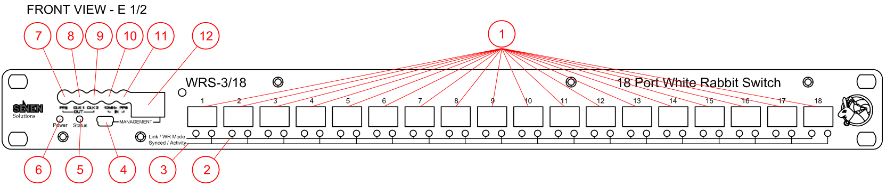

% WRS-3/18 - Allgemeine Einführung
% Benoit Rat, Rodrigo Agis (Seven Solutions)

### Copyright

Dieses Dokument ist (nach der Berner Übereinkunft) durch das Unternehmen Seven Solutions urheberrechtlich geschützt, und ist für die Öffentlichkeit unter der **GPL v2.0** Lizenz lizensiert.
Inhalte können kopiert, modifiziert und weiterverteilt werden.

Das Seven Solutions Logo darf in keiner Form verändert werden, ohne vorherige schriftliche Genehmigung von Seven Solutions.

### Lizenz

~~~~~~~
Die "Allgemeine Einführung" (wie nachstehend definiert) wird unter den Bedingungen der GPL v2.0 zur Verfügung gestellt.
Copyright (C) 2014 - Seven Solutions

Dieses Programm ist freie Software; es darf weitergegeben und / oder modifiziert werden, unter den Bedingungen der GNU General Public License, wie von der Free Software Foundation veröffentlicht; entweder nach Version 2 der Lizenz (nach Ihrer Wahl) oder jeder späteren Version.

Dieses Programm wird verteilt in der Hoffnung, dass es nützlich sein wird, aber OHNE JEDE GARANTIE; sogar ohne die implizite Garantie der
Marktfähigkeit oder Eignung für einen bestimmten Zweck. Siehe die
GNU General Public Lizenz für mehr Details.

Sie sollten eine Kopie der GNU General Public License mit diesem Programm erhalten haben; Falls nicht, schreiben Sie an die Free Software
Foundation, Inc., 51 Franklin Street, Fifth Floor, Boston, MA  02110-1301, USA.
~~~~~~~~~

Der [WRS] wurde veröffentlicht unter der **CERN OHL** Lizenz.

~~~~~~~
Copyright CERN 2011.
Diese Dokumentation beschreibt öffentliche Hardware und ist lizensiert unter der CERN OHL v. 1.2.

Sie können diese Dokumentation modifizieren und weitergeben unter den Bedingungen der CERN OHL v.1.2. (http://ohwr.org/cernohl). Diese Dokumentation wird verteilt, OHNE AUSDRÜCKLICHE ODER IMPLIZITE GARANTIE, EINSCHLIESSLICH DER HANDELSÜBLICHEN QUALITÄT UND EIGNUNG FÜR EINEN BESTIMMTEN ZWECK; Siehe CERN OHL v.1.2 für anwendbare Bedingungen.
~~~~~~~~~~~~~~~~~

\clearpage

### Revisionstabelle

------------------------------------------------------------------------
 Rev      Datum         Autor          Kommentare
-----  ----------- -------------------  --------------------------------
 0.1   18/02/2013   Benoit Rat\         Initiale Version\
                    [Seven Solutions]   Rezensent: Rodrigo Agis ([7S])

 0.2   26/03/2013   Benoit Rat\         Vorschlag hinzugefügt von\
                    [Seven Solutions]   Beck, Dietrich Dr (GSI)

 0.3   27/03/2013   Benoit Rat\         Lizenz geändert zu GPL v2.0\
                    [Seven Solutions]   um kompitabel mit dem Paket zu sein

 0.4   23/05/2013   Benoit Rat\         Aktualisieren 125MHz aus zu CLK
                    [Seven Solutions]

 0.5   26/07/2013   Benoit Rat\         Vorschlag hinzugefügt von\
                    [Seven Solutions]   Erik Van Der Bij (CERN)

 1.0   26/07/2013   Benoit Rat\         Update für v3.3 Veröffentlichung
                    [Seven Solutions]

 1.1   26/07/2014   Jose Luis Gutierrez\ WMI hinzugefügt für v4.0 Veröffentlichung
                    [Seven Solutions]

 1.2   02/10/2014   Benoit Rat\         Update für v4.1 Veröffentlichung
                    [Seven Solutions]
------------------------------------------------------------------------

\clearpage

### Glossar

DHCP
:   Das Dynamic Host Configuration Protocol, um die Netzwerkkonfiguration zu erhalten.
FMC
:	FPGA Mezzanine Card, ein ANSI standard für Mezzanine Card-Formfaktor.
HDL
:	Hardware description language.
LM32
:	LatticeMico32 ist ein 32-bit Mikroprozessor Weichkern optimiert für ein feldprogrammiertes Gate-Array (FPGAs).
NAND
:	NAND Flash Speicher, eine Art von umprogrammierbaren, nichtflüchtigen Computerspeicher.
PCIe
:	Peripheral Component Interconnect Express, ein serieller Hochgeschwindigkeits Erweiterungsbus-Standard für Computer
PTP
:	Precise Time Protocol, ein Zeit Synchronisierungs Protokoll.
SMC
:	SubMiniature version C, Koaxialverbinder der in Funkfrequenzschaltungen verwendet wird.
SFP
:	Small form-factor pluggable transceiver, ein Plug-and-Play Transceiver für Glasfaser.
SPEC
:	Einfacher PCIe FMC Träger.
SVEC
:	Einfacher VME FMC Träger.
UART
:	Universaler Asynchroner Empfänger/Sender.
WR
: 	White Rabbit.
WRS
: 	White Rabbit Switch.
WMI
:   Web Management Interface

\clearpage

Einführung
=================

Der White Rabbit Switch ([WRS]) ist die Kern-Komponente des
White Rabbit Protokolls, das präzisiertes Timing und hohe Synchronisation über Ethernet basierte Netzwerke bietet.

Über diese Einführung
-----------------

Dieses Dokument ist geplant als eine **Allgemeine Einführung**, um schnell einen Switch in Ihrem White Rabbit Netzwerk einzurichten. Für mehr Details zu fortgeschrittenen Themen, siehe bitte die [Erweiterte Konfiguration Sektion](#erweiterte-konfiguration) oder die anderen Bedienungsanleitungen.

Dieses Dokument ist nur geeignet für [WRS] v3.3 und v3.4.

Die offizielle Anleitung
---------------------

Dies ist die aktuelle Reihe von Handbüchern für den [WRS]:

WRS Startup Guide:
:	Hardware Installation

Dieses Dokument wird bereitgestellt von dem Hersteller. Es beschreibt Handhabungsmaßnahmen, die externe Anschlüsse, Hardware-Funktionen und die erste Initialisierung des Gerätes.

WRS User's Manual:
:	Dokumentation über die Konfiguration des [WRS], auf Software Ebene.

Dieses Dokument wird bereitgestellt von den Software Entwicklern.
Dieses Handbuch beschreibt die Konfiguration in einem bereitgestellten Netzwerk, entweder als selbstständiges Gerät, oder als Netzwerk-Erweiterung.
Dieses Handbuch beschreibt auch, wie Sie den Switch aktualisieren können, weil wir mit der Zeit neue Firmware bereitstellen werden, die neue Funktionen beinhalten.

WRS Developer's Manual:
:	es beschreibt den Entwicklungsprozess und die internen Vorgänge.

Dieses Handbuch kommt von Entwickler und ist für Entwickler.
Das Dokument ist dafür da, um zu überprüfen ob Sie Ihre [WRS] Software aus einem nicht offiziellen Repository aktualisieren müssen, oder ob Sie die Software mit zusätzlichen Konfigurationen installieren wollen.

Produktübersicht
==================

Paket
------------
Das [WRS] Paket besteht aus verschiedenen Elementen:

* Dem Verpackungskarton
* Ein Netzkabel, passend für das jeweilige Vertriebsland 
* Ein Switch mit 18 SFP-Ports
* SFP LC Anschlüsse
    * 16x AXGE-3454-0531 (violett)
    * 2x AXGE-1254-0531 (blau)

> ***Hinweis:*** Die SFP LC Anschlüsse sind optional. Wenden Sie sich an [SFPs Wiki] für weitere Informationen über die Kompatibilität von SFPs und wie man sie benutzt.

Frontplatte v3.4 (Legende)
---------------------

1. Die 18 SFP Ports
#. Synchronisierte/Aktivitäts-LEDs
#. Link/WR Modus LEDs
#. Management Mini-USB (B) Port
#. Status-LED
#. Betriebs-LED
#. PPS Ausgang
#. CLK1 Ausgang (10MHz von PLL)
#. CLK2 Ausgang (10MHz von FPGA)
#. 10MHz Referenztakteingang (GPS/Cäsium)
#. PPS in
#. Ethernet 100Mbps Management Port

Front panel v3.3 (Legende)
---------------------

1. Die 18 SFP-Ports
#. Synchronisierte/Aktivitäts-LEDs
#. Link/WR Modus LEDs
#. Management Mini USB (B) Port
#. Status-LED
#. Betriebs-LED
#. PPS Ausgang
#. CLK synchronisierter Referenzausgang (62,5 MHz)
#. PPS Eingang (GPS Clock)
#. 10 MHz Referenztakteingang (GPS / Cäsium)
#. 125 MHz Referenztakteingang (nicht verwendet)
#. Ethernet 100Mbps Management Port

Rückwand (Legende)
--------------------

13. Masseanschluss
#. Generische Taste
#. Blinkende Taste ([Siehe Firmware Update](#firmware-update))
#. RS232 Management Port (GPRMC)
#. FPGA Mini USB (B) UART
#. ARM Mini USB (B) UART
#. Netzschalter
#. Netzstecker-
#. Seriennummer und MACs

Grundlegendes
==================

Standard Einstellungen
----------------

Das Gerät ist ab Werk mit den folgenden Standardeinstellungen konfiguriert:

* Die IP Konfiguration ist **DHCP**
* MACs werden vom Hersteller angegeben; Kennzeichnung auf der Rückseite [#21](#rückwand-legende)
* MAC1 entspricht dem Management-Port (RJ45).
* MAC2 entspricht dem ersten SFP Port ($wr[0-17] \Leftrightarrow \textrm{MAC2}+[0-17]$).
* WR Modus ist **Clockausgang** (Simple Master)
* Die ersten 2 Ports (SFPs 1 & 2) werden als WR-Slave konfiguriert.
* Die anderen Ports (SFPs [3-18]) werden als WR Master konfiguriert.
* SSH Benutzer: **root**
* SSH Passwort: (leer/nur Enter drücken)
* Boot Methode: von Nandflash Firmware
* Web-Verwaltungsschnittstellen Benutzer: **admin**
* Web Management Interface Passwort: (leer)

Schnellstart
--------------

Um den Switch schnell zu starten, empfehlen wir Ihnen: 

1. Schließen Sie den Ethernet Port *Ethernet 100Mpbs Management Port* des Switches mit einen RJ45 Kabel an das DHCP Netzwerk.
#. Stecken Sie den Netzstecker ein.

Nachdem alle Anschlüsse erfolgt sind, drücken Sie den Power-Schalter um das Gerät einzuschalten. Nach dem Einschalten sollte der [WRS] folgendes Verhalten aufzeigen:
 
3. Die Power-LED leuchtet grün
#. Nach 15 Sekunden wird die Status-LED orange, was bedeutet, dass der [WRS] Kernel gestartet ist.
#. Dann werden die Lüfter starten, was bedeutet, dass die FPGA richtig programmiert wurden. 
#. Schließlich wird es grün, wenn alles Erfolgreich ist (PLL ist gesperrt).

Der [WRS] ist nun bereit, um im WR Netzwerk zu arbeiten.
 
7. Schließen Sie die blauen SFPs (AXGE-1254-0531) mit dem SFP-Port 1 und 2 der[WRS] an. Diese SFPs empfangen die Synchronisationsnachricht eines anderen Masters [WRS] oder eines Grandmasters [WRS]. Wenn Sie nur einen Switch im Netzwerk haben müssen Sie ihn vielleicht als [Grandmaster konfigurieren](#grandmaster-modus).
#. Sie können die anderen SFP-Ports [2-16] mit violetten SFPs (AXGE-3454-0531) zum Knoten verbinden wie [SPEC], [SVEC], ...

USB-Anschlüsse
----------------

Der [WRS] hat drei verschiedene USB-Ports, mit denen über ein PC kommuniziert werden kann.

a. Management-Mini-USB (B) Port
b. FPGA-Mini-USB (B) UART
c. ARM Mini-USB (B) UART

Diese Ports entsprechen denselben verschiedenen Geräten auf Ihrem Computer.

a. ttyACM0 (wenn die *Status-LED* grün)
b. ttyUSB0
c. ttyUSB1

Um sie zu verbinden, müssen Sie eine serielle Konsole wie minicom öffnen.[^minicom]

~~~~~ {.bash}
## Verbinden mit dem Management-USB-Anschluss
minicom -D /dev/ttyACM0 -b 115200

## Verbinden mit dem FPGA UART
minicom -D /dev/ttyUSB0 -b 115200

## Verbinden mit dem ARM UART
minicom -D /dev/ttyUSB1 -b 115200

~~~~~~~~~~~~

[^minicom]: In Debian-ähnliche Verteilung können Sie durch Ausführung des 
folgendem Codes installieren `sudo apt-get install minicom`.

> ***Hinweis***: ttyUSB0 und ttyUSB1 entsprechen normalerweise jeweils den FPGA und ARM UART.
Allerding ist diese Reihenfolge vom Anschluss des Kabels abhängig.

USB einloggen
--------------

Sobald das Gerät richtig in Betrieb genommen wurde (*Status-LED* grün),
wird es empfohlen, den USB-Management-Port anstelle des ARM UART zu verwenden, um eine Verbindung herzustellen.

~~~~~ {.bash}
## Verbinden mit dem Management-USB-Anschluss
minicom -D /dev/ttyACM0 -b 115200
~~~~~~~~~~

Die ARM-UART ist in der Regel während der Entwicklung und Überwachung beschäftigt, da der Kernel und deamons-Mitteilungen zur Konsole gesendet werden.

SSH einloggen
--------------

Der Ethernet-Management-Port erhält automatisch die IP mit dem DHCP
Protokoll. Wenn Sie noch keine DHCP-Router / Server in Ihrem Netzwerk haben,
finden Sie sie im Abschnitt [Nicht-DHCP](#non-dhcp-user).

Um die IP des [WRS] zu erhalten, können Sie sich mit der DHCP-Server-Schnittstelle 
verbinden, oder [mit ttyACM0 verbinden](#usb-einloggen) um die IP zu erhalten (`ipconfig eth0`).

Wenn die [WRS] IP beispielsweise `192.168.1.50` ist, können Sie die Verbindung über:

	ssh root@192.168.1.50

und betätigen der Eingabetaste, wenn die Eingabe des Passworts erfordert wird, herstellen.

Anmelden mit Windows
-----------------------

Der Prozess der Anmeldung mit Windows (XP, Vista, 7,8) ist ziemlich
ähnlich:

1. Zuerst müssen Sie die [Putty Tool] herunterladen und installieren.

2. Dann müssen Sie die entsprechende serielle Schnittstelle in der Anschlussliste finden. 
Um diese zu finden, kann man bei eingestecktem USB-Stecker den Namen des `COM <X>` Port unter `Geräte-Manager> Anschlüsse (COM und LPT)`, ablesen.

3. Zum Schluss müssen Sie nur das Putty-Tool öffnen um es dann wie unten in der Abbildung zu konfigurieren. Dabei ist zu beachten, dass der Anschlussnamen `COM9` den passenden USB-Namen unter Windows entspricht.

4. Ebenso können Sie sich über dem SSH Protokoll mit dem [WRS] verbinden. 
Bei dieser Verbindung muss die IP von der [WRS] (gelb) mit der vom Subnetzwerk ersetzt werden

Login über die Web-Verwaltungsschnittstelle (WMI)
-----------------------

Wenn Sie den Zugriff auf und den [WRS] mit Hilfe der Web-Oberfläche verwalten möchten, ist es notwendig den [WRS] Manager Ethernet-Port mit
Ihrem lokales Netzwerk zu verbinden. Dann können Sie die IP wie in 
[Anmeldung über SSH](#ssh-einloggen) erhalten.
Der Zugang sollte von einem Netzwerk-Browser (Mozilla Firefox und Google Chrome unterstützt) wie folgt durchgeführt werden:

1. Öffnen Sie Ihren Browser und geben Sie die IP-Adresse (z.B. 192.168.1.50) 
des [WRS] ein. Standardmäßig ist die Netzwerk-IP-Konfiguration
von dem DHCP-Server in einem Netzwerk bereitgestellt und wird von ihm zurückgegeben.

2. Nach dem Zugriff auf die  **WMI** sollten Sie den Web-Oberfläche Benutzer
 mit Kennwort eingeben, dieses ist nicht das gleiche wie für die SSH-Verbindung.
Ansonsten sehen Sie nur die Dashboard-Informationen. Standardmäßig ist der 
Benutzer **admin** ohne Passwort. Aus diesem Grund wird dringend empfohlen, 
das Passwort zu ändern.

Um das  **WMI** Passwort zu ändern, müssen Sie auf der linken Seite der Webseite
auf  "**User: admin**" klicken. Danach müssen Sie Ihren Benutzernamen 
(**admin**), altes Passwort, neues Passwort und Wiederholung des neuen Kennworts
eingeben. Sobald Sie das neue Passwort bestätigen, werden Sie zum
Hauptbildschirm umgeleitet und abgemeldet.

Web Management Interface Features:
-------------------

**WMI** ist eine Web-Schnittstelle, die die [WRS] Verwaltung über einen Webbrowser ermöglicht. Es zeigt die Hauptkonfiguration und den Status der wichtigsten Dienstleistungen und Programme, die für den Schalter zur Verfügung stehen, wie zum Beispiel Modus "Endpunkte" und Kalibrierungsstatus, SFP Kalibrierung, PTP, SNMP, VLANs usw. Es fungiert als eine Abstraktionsschicht zwischen dem back-end scripts und Programme im */wr/bin/* Ordner, so dass das WR Switch-Management für den Benutzer einfacher wird.

Liste aller Aktionen, die mithilfe des  **WMI** durchgeführt werden können:

- Display-Informationen: HW Informationen, Dienstleistungen Status und Hauptkonfiguration.
- Stop/laufen Dienstleistungen: EQI, WRSW_HAL, NTP.
- NTP-Server-Setup.
- Ändert Endpunkt wr_master/wr_slave Modus.
- VLAN-Setup.
- White-Rabbit Timing.
- Maximale Dateigröße der hochgeladenen Dateien auf den Schalter ändern.
- EQI Daemon-Konfiguration: Clock Klasse, Taktgenauigkeit usw.
- Terminal Simulation vermeiden SSH-Verbindungen.
- Login System.
- Ändern Login-Passwort.
- LM32 und FPGA-Binärdateien in den Schalter laden.
- Schalter Neustart.
- Sicherung und Wiederherstellung von Konfigurationsdateien für Dienste (EQI, HAL, SNMP, etc.).
- Wiederherstellung von Konfigurationsdateien aus Tarball.
- Flash-Firmware.
- Backup-Firmware.

Wenn Sie mehr über die einzelnen Kapitel wissen wollen, können Sie auf das Hilfesymbol klicken, 
dass Sie auf der rechten oberen Ecke jeder Seite zu finden.

Console-Tools:
-------------------

Sobald Sie über ein Terminal angemeldet sind, können Sie verschiedene Werkzeuge
 verwenden, um den [WRS] zu überwachen.
Alle diese Werkzeuge können in `/wr/bin/` gefunden werden, welche in `$PATH` enthalten sind.

Die folgende Liste beinhaltet die interessantesten Befehle:

 * `wrs_version`: Gibt Informationen über die SW & HW-Version des [WRS] wieder.
 * `rtu_stat`: Routing Table Unit Statistic, gibt die Informationen der Routing Tabelle zurück. Hier ist zu finden welche MAC zu welchem Port weitergeleitet werden muss. Es erlaubt Ihnen auch, Einträge hinzuzufügen oder zu löschen.
 * `wr_mon`: WR Switch Sync-Monitor, gibt Informationen über den Zustand der WR Synchronisation zurück wie z.B. Phase Tracking, Master-Slave-delay, link asymmetry, etc ...
 * `wrs_vlans`: Erstellung und Konfiguration von VLANs.

> ***Hinweis:*** Weitere Informationen zu den Tools sind in der [wrs-user-manual.pdf] erklärt oder können über die integrierten Hilfe Argumente: `--help`,` -h` oder `help ` erhalten werden.

#### Warnung:
Die SFP-Ports sind auf dem Front Panel von 1 bis 18 beschriftet, die entsprechenden 
Netzwerkschnittstellen sind allerdings mit `wr0` bis `wr17` benannt.

Konfigurationen
==================

Wir empfehlen Ihnen sehr, den Switch mit Hilfe des Web-Management zu konfigurieren.
Wenn Sie es jedoch vorziehen, ihn mit einem Terminal zu konfigurieren folgen Sie den unten aufgeführten Beispielen.

Booting
------------

Nach 10 Sekunden lädt der Bootloader automatisch die [WRS] Firmware aus dem Flash-NAND-Speicher des Switches. Wenn Sie sich mit dem ARM-Debug-Port verbinden, können Sie die folgende Meldungen sehen:

~~~~~{.bash}
Welcome on WRSv3 Boot Sequence
      1: boot from nand (default)
      2: boot from TFTP script
      3: edit config
      4: exit to shell
      5: reboot
~~~~~~~~~~~~~~~~~~~

> ***Hinweis:***
Falls Sie den Bootvorgang des [WRS] ändern wollen, können Sie ein `wrboot` Script in Ihrem TFTP root Ordner setzen und die zweite Option auswählen, oder Sie können die Konfiguration bearbeiten (dritte Option). Weitere Erläuterungen finden Sie in der [wrs-user-manual.pdf].

Non-DHCP user
---------------

Wenn Sie keinen DHCP-Server in Ihrem Netzwerk haben, müssen Sie den [WRS] mit Hilfe des
[Login via USB Verfahren](#usb-einloggen) verbinden und anschließend die `interfaces` Datei bearbeiten:

~~~~{.bash}
vi /usr/etc/network/interfaces
~~~~~~~~~~~

Zum Beispiel in einem `192.168.1.x` Subnetz könnten Sie `iface eth0 inet dhcp` durch folgendes ersetzen:

~~~~~{.bash}
iface eth0 inet static
     address 192.168.1.10
     netmask 255.255.255.0
     network 192.168.1.0
     broadcast 192.168.1.255
     gateway 192.168.1.1
~~~~~~~~~~~~~~

> ***Hinweis:*** Wenn Sie das TFTP Skript in einem non-DHCP Netzwerk verwenden wollen, müssen Sie auch die IP in der Bootloader Konfiguration statisch setzen.

Grandmaster-Modus
-----------------

In einem White Rabbit Netzwerk werden fast alle Switches als Master konfiguriert (auch bekannt als SimpleMaster: Standardkonfiguration). Sie übertragen das Taktsignal, das von anderen Switches kommt.
Allerdings wird der "Haupt" Switch, an dem das GPS-Signal angeschlossen ist, als **GrandMaster** bezeichnet und wird in einer bestimmten Weise konfiguriert.

Um einen Switch als Grandmaster zu konfigurieren müssen Sie die `wrsw_hal.conf` Datei bearbeiten[^viedit]

~~~~~~~~{.C}
vi /wr/etc/wrsw_hal.conf
~~~~~~~~

Und unkommentiert der timing.mode Wert in der Zeile darunter:

~~~~~~~~{.Haskell}
timing =  {
    -- other values
    mode = "GrandMaster"; -- grand-master with external reference
};
~~~~~~~~

Schließlich müssen Sie die 10 MHz und PPS von einer Taktquelle den Schalter SMC Eingänge an, und starten Sie den Schalter.

Für eine detailliertere Erklärung, wie die Konfiguration und schließen Sie das Gerät wie Grandmaster, konsultieren Sie bitte das
[wr_external_reference.pdf] Dokument.

[^viedit]: So bearbeiten Sie in `vi`:` Text Ins` einfügen; `Esc` den Normalmodus zurück; `:Wq` Speichern und Beenden

Firmware-Updates
------------------

Seit der Firmware Version 4.1 haben wir den Update-Vorgang verbesserte, der Switch ist nun in der Lage sich selbst zu aktualisieren.

Kopieren Sie einfach die in den Ordner `/update` gedownloadete Firmware auf den Switch.
Das kann zum Beispiel wie folgt gemacht werden:

    scp wr-switch-sw-v<X.X-YYYYMMDD>_binaries.tar root@192.168.1.50:/update/wrs-firmware.tarar

Starten Sie anschließend den Switch neu.

Sie können auch das Menü  `Advanced Mode> Firmware` im Web-Interface nutzen, um diesen Schritt auszuführen.

> ***Hinweis:*** Wenn Sie ein Upgrade von der Version 3.3 oder Version 4.0 machen wollen beziehen Sie sich bitte auf das alte Handbuch.

Erweiterte Konfiguration
-----------------------

Bitte beziehen Sie sich auf den White Rabbit Switch: software build scripts manual
([wrs-user-manual.pdf]), dieses erklärt fortgeschrittene Themen wie:

* Erweiterte blink Optionen.
* Das Konfigurieren spezifischer MAC-Adresse.
* Änderung des Bootloaders.
* Ändern des Slave / Master-Port-Typ.
* Building aus den Quellen.
* etc.

Sicherheitshinweise
=============

#### Warnung:
Blockieren Sie nicht die Lüftungsschlitze, die sich auf der Rückseite des [WRS] befinden, sonst könnte 
die Innentemperatur ansteigen und den Schalter beschädigen.

#### Warnung:
Um die Lebensdauer des [WRS] zu erhöhen, wird empfohlen, den Schalter
in einer gesteuerten Umgebungsbedingungen zu verwenden. Die Grenze für die Umgebungsbedingung ist 
in der [Spezifikation Appendix](#spezifikation) angegeben.

#### Warnung:
Dieses Gerät ist für eine Arbeit in dem Spannungsbereich von 110-240V 50-60Hz geeignet.

#### Warnung:
Dieses Gerät soll mit Hilfe der *Grounded Stecker* geerdet werden. Um
sicherzustellen, dass der Host während des normalen Gebrauchs mit Erde verbunden ist. 

Anhang
============

Spezifikation
----------------

+----------------------+----------------------------------------------------+
| ***FPGA***           |                                                    |
+======================+====================================================+
| **Type**             | Xilinx Virtex-6 (LX240T)                           |
+----------------------+----------------------------------------------------+
| **Paket**            | 1156-pin BGA                                       |
+----------------------+----------------------------------------------------+
| **Scheiben**         | 37.680 (4 LUTs und 8 Flip-Flops)                   |
+----------------------+----------------------------------------------------+
| **Erinnerungen**     | 416x36Kb (9,504Kb) Block RAM \                     |
|                      | 32 MB NOR-Flash                                    |
+----------------------+----------------------------------------------------+
| **Softcore**         | LatticeMico32 (LM32)                               |
+----------------------+----------------------------------------------------+
| **I/O**              | 20 GTX-Transceivern für SFP Links \                |​​
|                      | 40 GPIO für generische Zwecke                      |
|                      | (LEDs, SFP Erkennung, ...)                         |
+----------------------+----------------------------------------------------+
| **Überwachung**      | Überwachung Stromversorgung                        |
+----------------------+----------------------------------------------------+
| **Temperatur**       | Sensorsteuerung                                    |
+----------------------+----------------------------------------------------+

+----------------------+----------------------------------------------------+
| ***CPU***            |                                                    |
+======================+====================================================+
| **Typ**              | ARM Atmel AT91 SAM9G45                             |
+----------------------+----------------------------------------------------+
| **Kern**             | 400 MHz (ARM926E)                                  |
+----------------------+----------------------------------------------------+
| **Erinnerungen**     | 64 MB DDR2 (16-Bit-Bus-Chip) \                     |
|                      | 256 MB NAND-Flash-Chips \                          |
|                      | 8 MB Boot-Flash                                    |
+----------------------+----------------------------------------------------+
| **I/O**              | 32bit Async-Brücke mit FPGA \                      |
|                      | 100Base-T Ethernet                                 |
+----------------------+----------------------------------------------------+
| **OS**               | Linux (Kernel v2.6.39)                             |
+----------------------+----------------------------------------------------+

+----------------------+----------------------------------------------------+
| ***OnChip Clock***   |                                                    |
+======================+====================================================+
| **PLL**              | AD9516 (14-Output Clock Generator                  |
|                      | Mit integrierter 1,6 GHz VCO)                      |
+----------------------+----------------------------------------------------+
| **Synthesizer**      | TI CDCM61002RHBT (28-683MHz)                       |
+----------------------+----------------------------------------------------+
| **DAC**              | 2xAD5662BRJ (16 Bit; 2.7-5.54V)                    |
+----------------------+----------------------------------------------------+

+----------------------+----------------------------------------------------+
| ***Sonstiges***      |                                                    |
+======================+====================================================+
| **Löten**            | IPC-610 Rev E Klasse 2                             |
+----------------------+----------------------------------------------------+
| **Zertifizierung**   | ISO-9001, ISO-14001, CE, RoHS                      |
+----------------------+----------------------------------------------------+
| **Netzteil**         | 100-240VAC, 50-60 Hz 2,0 A \                       |
|                      | 12 V DC, 6.66A - 80W max                           |
+----------------------+----------------------------------------------------+
| **Umwelt**           | Temperatur: -10 ° C ~ + 50 ° C \                   |
| **Bedingungen**      | Luftfeuchtigkeit: 0% ~ 90% RH                      |
+----------------------+----------------------------------------------------+

Eigenschaften
----------

* PTPv2 (IEEE 1588-2008) mit EQI
* WRP-Daemon (Knoten Entdeckung, etc.)
* VLANs
* DHCP-Client
* SSH-Server
* Web-Verwaltungsschnittstelle
* SNMP
* Rsyslog
* Python Unterstützung
* NTP Client / Relay / Server
* ARP / DNS / etherwake Protokoll

Garantie
-------------

Der [WRS] ist vollständig im Werk getestet und gegen Fabrikationsfehler für die Dauer von einem Jahr gewährleistet. Die
Umstände, unter denen der [WRS] in Betrieb genommen wird, können nicht kontrolliert werden. der Ausfall des [WRS] durch
Installationsprobleme kann nicht garantiert werden. Dies schließt Missbrauch, falsche Verdrahtung, Überhitzung, den Betrieb unter Last über die Designlinie des [WRS] ein.
Für Ersatz in oder außerhalb der Garantie senden Sie den [WRS], an:

> Seven Solutions \
C / Baza, parcela 19, Langhaus 3 \
Polígono Industrial Juncaril, \
18210 Peligros \
(Granada), Spanien.

FAQs & Störungssuche
--------------------------

Bei Fragen wenden Sie sich bitte zunächst an die [WRS FAQ] Wiki Seite. 

Unter dem folgendem Link können Sie zu bekannten Fehlern Lösungen finden.

<Http://www.ohwr.org/projects/wr-switch-sw/wiki/Bugs>

Außerdem können Sie unseren technischen Support kontaktieren
[Kontaktaufnahme mit unserem Unternehmen](#kontaktieren-sie-uns)

### Bug Bericht

Gerne können Sie uns Ihren vollen Zustand des [WRS] durch den Fehlerbericht senden.
Es erfolgt durch folgendem Befehl:

~~~~~~~~~~~~{.bash}
#On Der WRS
wrs_version> /tmp/bug_report.txt
rtu_stat >> /tmp/bug_report.txt
dmesg >> /tmp/bug_report.txt

#Obtain Die IP des Schalters
ifconfig eth0 | grep addr
~~~~~~~~~~~~

Abrufen der Datei von Ihrem Computer mithilfe von SSH:

~~~~~~~~~~~~{.bash}
#On Ihre Kunden
scp root @ <IP_of_the_switch>:/tmp/bug_report.txt ~
~~~~~~~~~~~~~~

Kontaktieren Sie Uns
-----------

Um Seven Solutions zu erreichen wenden Sie sich bitte an:

* <Info@sevensols.com>
* (+34) 958 285 024
* <Http://www.sevensols.com>

Schonen Sie unsere Umwelt
---------------------

 \

Dieses Symbol bedeutet, dass bei Ablauf seines Lebenszyklus, 
das Gerät zu einem Recycling-Zentrum gebracht und getrennt vom Hausmüll entsorgt werden muss.

Der Karton, der in der Verpackung enthaltenen Kunststoff,
und die Teile, aus denen sich dieses Gerät besteht, muss
nach regional verankerte Vorschriften recycelt werden.

Das Gerät darf nie zusammen mit
Hausmüll entsorgt werden. Abhängig vom Gesetzt kann es zu Strafen und Sanktionen kommen. Stattdessen fragen Sie nach Anweisungen
Ihrer Stadtverwaltung, wie man es richtig entsorgt.
Bitte zeigen Sie Verantwortung und schützen die Umwelt.

Referenzen
==============

* [wrs-3/18.pdf]: Datenblatt für den White Rabbit Switch v3 - 18 SFPs
* [wrs-user-manual.pdf]: Bedienungsanleitung Dokumentation der Werkzeuge.
* [wr_external_reference.pdf]: Schließen Sie die [WRS] in Grandmaster-Modus.
* [whiterabbitsolution]: White Rabbit als komplette Timing-Lösungen
* [WRS Wiki]: White Rabbit  Wiki auf ohwr.org
* [WRS FAQ]: WR-Switch Häufig gestellte Fragen
* [wr-switch-testing]: Projekt zur Selbstprüfung des Switches 
* [SFPs Wiki]: Art der SFP der [WRS] unterstützt
* [latest stable release]: http://www.sevensols.com/dl/wr-switch-sw/bin/latest_stable.tar.gz
* [Flashing Paket]: http://www.sevensols.com/dl/wrs-flashing/latest_stable.tar.gz

<!-- Linkliste -->

[whiterabbitsolution]: http://www.sevensols.com/whiterabbitsolution/
[WRS]: http://www.sevensols.com/en/products/wr-switch.html
[WR Wiki]:	http://www.ohwr.org/projects/white-rabbit/wiki
[WRS Wiki]:	http://www.ohwr.org/projects/white-rabbit/wiki/Switch
[wr-switch-sw]: http://www.ohwr.org/projects/wr-switch-sw/
[wr-switch-hdl]: http://www.ohwr.org/projects/wr-switch-hdl/
[wr-switch-hw]: http://www.ohwr.org/projects/wr-switch-hw/
[wr-switch-testing]: http://www.ohwr.org/projects/wr-switch-testing
[wr-starting-kit]: http://www.ohwr.org/projects/wr-starting-kit/
[SPEC]: http://www.ohwr.org/projects/spec/
[SVEC]: http://www.ohwr.org/projects/svec/
[SFPs Wiki]: http://www.ohwr.org/projects/white-rabbit/wiki/SFP
[Seven Solutions]: http://www.sevensols.com
[7S]: http://www.sevensols.com
[Putty Tool]: http://www.putty.org/
[WRS FAQ]: http://www.ohwr.org/projects/white-rabbit/wiki/FAQswitch
[wrs-user-manual.pdf]: http://www.sevensols.com/dl/wr-switch-sw/latest_stable.pdf
[wr_external_reference.pdf]: http://www.ohwr.org/attachments/1647/wr_external_reference.pdf
[wrs-3/18.pdf]: http://www.sevensols.com/whiterabbitsolution/files/7SP-WRS-3_18.pdf
[latest stable release]: http://www.sevensols.com/dl/wr-switch-sw/bin/latest_stable.tar.gz
[Flashing Paket]: http://www.sevensols.com/dl/wrs-flashing/latest_stable.tar.gz

